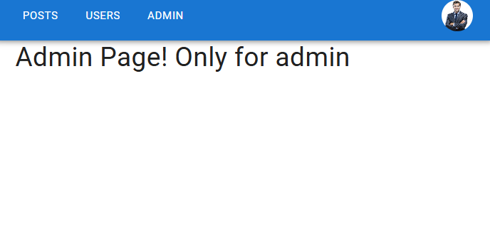

## Задание

### Сделать приложение - форум.

1. Создать каркас через удобный вам сборщик (можно и react-create-app), использовать исключительно хуки, без классовых компонентов, API (как вариант) - https://jsonplaceholder.typicode.com/
2. Дизайн на ваше усмотрение, но должно быть современно.
3. Форум должен содержать:

- Пользователей;
- Посты пользователей;
- Возможность просматривать все посты;

- Фильтрация постов по юзерам;

- Просматривать каждый пост по отдельности отдельной страничкой с отдельным роутом;
- Смотреть комменты к каждому посту;
- Оставлять комменты (как таковой возможности через API может и не быть, в таком случае сделать просто на стороне фронта до перезагрузки страницы)
- Создавать/Удалять посты;
- Ставить лайк/дизлайк на пост;
- Добавлять посты в избранное;

4.  Также приложение должно включать в себя личный кабинет пользователя, в котором можно просмотреть и редактировать информацию (имя, емэйл, адрес и прочее).

5.  Cо звёздочкой - админка, если юзер - админ - он имеет доступ по роуту из личного кабинета к страничке со всеми юзерами, где он может редактировать информацию о них. Также админ может задавать постам приоритет (подымать в топы, менять местами).
    Будет плюсом если приложение будет на TypeScript.

6.  Для приложения необходимо создать новый проект на гитхабе.

## Использованные технологии

- React + Vite: для разработки пользовательского интерфейса.
- TypeScript: для строгой типизации и повышения качества кода.
- React Router: для навигации по страницам.
- Redux Toolkit: для управления состоянием.
- RTK Query: для работы с API.
- Material-UI: для стилизации компонентов.
- JSON Server: для имитации серверного API. Создал Сервер, добавил фейковый токен авторизации.

## Запуск Приложения

Установка зависимостей:

`npm install`

Запуск фейкового сервера json-server:

`npm run start:dev:server`

Сборка приложения:

`npm run build`

Установить сервер для раздачи статических файлов:

`npm install -g serve`

Запуск сервера:

`serve -s dist`

Описание проекта...

## Скриншоты:

### Посты пользователей

### Страница фаворитов

### Пост на отдельном роуте с коментариями

### Страница с пользователями

### Создание Поста

### Меню для навигации для страниц профиль и фавориты

### Страница Профиля

### Страница Профиля, текущий профиль можно изменять

### Страница Профиля, сохранения поста

### Приватный роут если пользователь не админ

### Страница достпная только для Админа

### Ссылки для Админа

